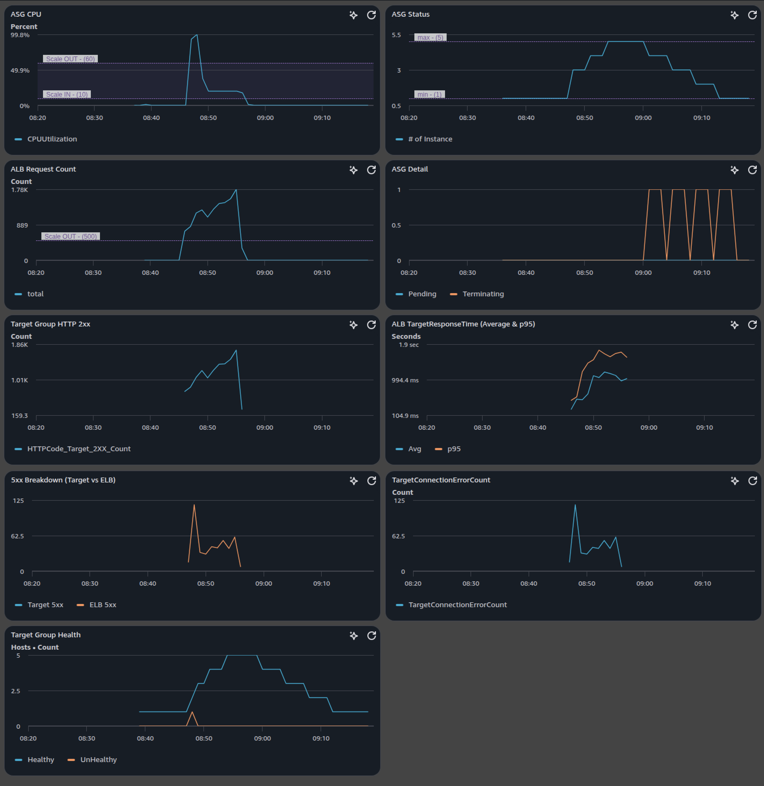

# Demo: ASG + ALB Autoscaling with Observability & Private-Only Access (IaC)
An end‑to‑end Infrastructure‑as‑Code project that bakes a JMeter AMI, deploys an internal ALB fronting an EC2 Auto Scaling Group, drives synthetic load from a private JMeter runner, and ships a CloudWatch dashboard to validate scaling behavior in real time—all without Internet/NAT Gateways.

# Features
* Packer‑baked JMeter AMI (Amazon Linux 2023 + Corretto 17 + JMeter 5.6.3) for reproducible load generation
* ASG with Step Scaling on CPU and ALB RequestCount with warmup/cooldown tuning
* Internal ALB (port 80 → target port 8080) with /health checks
* Private-only VPC with SSM Interface Endpoints → no NAT, no public IPs
* CloudWatch Dashboard (“demo-asg-alb”) to visualize CPU, scaling activity, response time, errors, health
* Session Manager access to the JMeter runner (no bastion)
* Modular Terraform: vpc, sg, alb, asg, ec2, cloudwatch
* Makefile workflows for both Terraform and Packer

# Architecture (High-Level)
```
+---------------------------- VPC (10.10.0.0/16) ----------------------------+
|  Private Subnets (x2)                                                      |
|                                                                            |
|  [JMeter EC2] --SG--> [ALB (internal, :80)] --SG:8080--> [ASG EC2 targets] |
|                                                                            |
|  VPC Interface Endpoints: SSM, SSMMessages, EC2Messages                    |
|  (Session Manager connectivity; no Internet/NAT)                           |
+----------------------------------------------------------------------------+
```
**Traffic path**: JMeter → ALB (80) → App targets (8080)\
**Access**: Only via SSM Session Manager, no public ingress/egress\
**Observability**: CloudWatch dashboard + ASG/ALB metrics

# Repo Layout
```
environment/dev/        # Environment definition & Makefile
modules/                # Reusable Terraform modules (vpc, sg, alb, asg, ec2, cloudwatch)
services/shared/        # Composition layer wiring all modules together
packer/                 # Packer template + scripts for JMeter AMI
```
Key files to know:
* environment/dev/main.tf – locals for VPC/ALB/ASG/EC2 configs
* modules/asg/main.tf – launch template, ASG, alarms, step‑scaling policies
* modules/alb/main.tf – ALB, target group, listener (port 80 → target 8080, /health)
* modules/cloudwatch/main.tf – dashboard JSON
* packer/jmeter-ami.pkr.hcl – JMeter AMI build spec

# Quick Start
### 1. Build the JMeter “golden AMI” with Packer
```
cd packer/
make login PROFILE=<your-profile>
make init
make build
```
After a successful build, note the AMI ID printed in the terminal.
> The Packer template installs JMeter, Corretto 17, and copies test.jmx + helper scripts into /opt/jmeter. AMI is based on Amazon Linux 2023.

### 2. Prepare environment variables
Edit the following:
* environment/dev/variables.tf
    * Set jmeter_ami_id = "<the AMI ID from step 1>"
    * (Optionally) adjust identity, product, service, region, profile_infra
* environment/dev/backend.conf
    * Update S3 backend bucket, key, region, profile

### 3. Deploy the infrastructure
```
cd environment/dev
make login PROFILE=<your-profile>     # ensure you SSO with the same profile
make init
make apply
```
**Outputs**: Capture the alb_dns output after apply. This is the internal ALB DNS name.

# Run Load & Validate Scaling
### 1. Connect to the JMeter instance
- Open the EC2 Console → find the instance named jmeter
- Click Connect → Session Manager (no SSH keys, no public IPs)

### 2. Raw JMeter command
```
sudo /opt/jmeter/bin/jmeter -n \
  -t /opt/jmeter/test.jmx \
  -Jtarget_host=<ALB_DNS> \
  -Jthreads=50 -Jrampup=400 -Jduration=600 -Jcores=1
```

### 3. Observe autoscaling in real time
Open CloudWatch → Dashboards → demo-asg-alb and watch:
* ASG CPU with Scale OUT / IN threshold annotations
* ASG Status (# InService) + Pending / Terminating
* ALB RequestCount
* TargetResponseTime (avg & p95)
* HTTP 5xx breakdown (Target vs ELB)
* TargetConnectionErrorCount
* Target group health (Healthy/UnHealthy)
> You should see scale‑out on sustained CPU ≥ 60% or ALB RequestCount ≥ 500/min, and scale‑in when CPU ≤ 10% for 3 evaluation periods.

# Security & Cost Notes
* No public IPs on instances; no NAT Gateways.
* Access via AWS Systems Manager (Session Manager) using IAM + VPC endpoints.
* SG‑to‑SG references restrict traffic path (least privilege).
* Baking dependencies in AMI removes the need for Internet during bootstrap.

# Clean Up
```
cd environment/dev
make destroy
```
This removes VPC, endpoints, ALB, ASG, IAM roles/profiles, EC2 instances, and dashboard.
Remember to keep or deregister the **Packer AMI** separately if needed.

# Results
#### Cost‑Optimized Security (No‑NAT design)
> baked all dependencies into the AMI with Packer so instances run entirely in private subnets with no Internet/NAT. Access is via SSM over VPC Endpoints. This reduces attack surface and eliminates NAT costs. Security groups use SG‑to‑SG references to tightly control paths.

#### Metric‑Driven Step Scaling (Anti‑flap tuning)
> used Step Scaling on CPU and ALB RequestCount, with warmup (120s), cooldown (180s), and evaluation periods tuned to prevent flapping. Scale‑out reacts differently to mild vs. spiky load; scale‑in waits for sustained low CPU. The health check grace (300s) protects fresh instances during bootstrap.

#### Observability as Code with a Feedback Loop
> ship a CloudWatch dashboard alongside infra, generate synthetic load from a private JMeter runner, watch CPU / capacity / latency / 5xx / health, and validate that thresholds match reality. It’s a closed loop from load → telemetry → scaling decisions.

<details>
<summary>JMeter Summary Report</summary>

```
Creating summariser
Created the tree successfully using /opt/jmeter/test.jmx
Starting standalone test @ 2026 Feb 20 00:46:08 UTC (1771548368887)
Waiting for possible Shutdown/StopTestNow/HeapDump/ThreadDump message on port 4445
summary +    317 in 00:00:21 =   15.1/s Avg:   121 Min:     5 Max:   290 Err:     0 (0.00%) Active: 3 Started: 3 Finished: 0
summary +    413 in 00:00:30 =   13.8/s Avg:   358 Min:   147 Max:   592 Err:     0 (0.00%) Active: 7 Started: 7 Finished: 0
summary =    730 in 00:00:51 =   14.3/s Avg:   255 Min:     5 Max:   592 Err:     0 (0.00%)
summary +    415 in 00:00:30 =   13.8/s Avg:   571 Min:   358 Max: 10008 Err:     2 (0.48%) Active: 11 Started: 11 Finished: 0
summary =   1145 in 00:01:21 =   14.1/s Avg:   369 Min:     5 Max: 10008 Err:     2 (0.17%)
summary +    431 in 00:00:30 =   14.4/s Avg:   819 Min:   400 Max: 10006 Err:    14 (3.25%) Active: 14 Started: 14 Finished: 0
summary =   1576 in 00:01:51 =   14.2/s Avg:   492 Min:     5 Max: 10008 Err:    16 (1.02%)
summary +    453 in 00:00:30 =   15.1/s Avg:  1023 Min:     0 Max: 26550 Err:   106 (23.40%) Active: 18 Started: 18 Finished: 0
summary =   2029 in 00:02:21 =   14.4/s Avg:   611 Min:     0 Max: 26550 Err:   122 (6.01%)
summary +    731 in 00:00:30 =   24.4/s Avg:   880 Min:     3 Max: 10330 Err:    11 (1.50%) Active: 22 Started: 22 Finished: 0
summary =   2760 in 00:02:51 =   16.1/s Avg:   682 Min:     0 Max: 26550 Err:   133 (4.82%)
summary +    708 in 00:00:30 =   23.6/s Avg:   956 Min:     3 Max: 10006 Err:    16 (2.26%) Active: 26 Started: 26 Finished: 0
summary =   3468 in 00:03:21 =   17.3/s Avg:   738 Min:     0 Max: 26550 Err:   149 (4.30%)
summary +    554 in 00:00:30 =   18.5/s Avg:  1510 Min:     5 Max: 11877 Err:    17 (3.07%) Active: 29 Started: 29 Finished: 0
summary =   4022 in 00:03:51 =   17.4/s Avg:   844 Min:     0 Max: 26550 Err:   166 (4.13%)
summary +    537 in 00:00:30 =   17.9/s Avg:  1732 Min:   167 Max: 19650 Err:    17 (3.17%) Active: 33 Started: 33 Finished: 0
summary =   4559 in 00:04:21 =   17.5/s Avg:   949 Min:     0 Max: 26550 Err:   183 (4.01%)
summary +    546 in 00:00:30 =   18.2/s Avg:  1905 Min:   588 Max: 10006 Err:    13 (2.38%) Active: 37 Started: 37 Finished: 0
summary =   5105 in 00:04:51 =   17.5/s Avg:  1051 Min:     0 Max: 26550 Err:   196 (3.84%)
summary +    531 in 00:00:30 =   17.7/s Avg:  2116 Min:     3 Max: 19556 Err:    22 (4.14%) Active: 41 Started: 41 Finished: 0
summary =   5636 in 00:05:21 =   17.6/s Avg:  1151 Min:     0 Max: 26550 Err:   218 (3.87%)
summary +    744 in 00:00:30 =   24.8/s Avg:  1678 Min:     3 Max: 19950 Err:    21 (2.82%) Active: 44 Started: 44 Finished: 0
summary =   6380 in 00:05:51 =   18.2/s Avg:  1213 Min:     0 Max: 26550 Err:   239 (3.75%)
summary +    713 in 00:00:30 =   23.7/s Avg:  1932 Min:     3 Max: 66129 Err:    22 (3.09%) Active: 48 Started: 48 Finished: 0
summary =   7093 in 00:06:21 =   18.6/s Avg:  1285 Min:     0 Max: 66129 Err:   261 (3.68%)
summary +    708 in 00:00:30 =   23.6/s Avg:  2122 Min:   289 Max: 77987 Err:    19 (2.68%) Active: 50 Started: 50 Finished: 0
summary =   7801 in 00:06:51 =   19.0/s Avg:  1361 Min:     0 Max: 77987 Err:   280 (3.59%)
summary +    721 in 00:00:30 =   24.0/s Avg:  2083 Min:   613 Max: 10172 Err:    27 (3.74%) Active: 50 Started: 50 Finished: 0
summary =   8522 in 00:07:21 =   19.3/s Avg:  1422 Min:     0 Max: 77987 Err:   307 (3.60%)
summary +    725 in 00:00:30 =   24.2/s Avg:  2085 Min:   568 Max: 10005 Err:    27 (3.72%) Active: 50 Started: 50 Finished: 0
summary =   9247 in 00:07:51 =   19.6/s Avg:  1474 Min:     0 Max: 77987 Err:   334 (3.61%)
summary +    704 in 00:00:30 =   23.5/s Avg:  2163 Min:   437 Max: 10112 Err:    24 (3.41%) Active: 50 Started: 50 Finished: 0
summary =   9951 in 00:08:21 =   19.9/s Avg:  1523 Min:     0 Max: 77987 Err:   358 (3.60%)
summary +    835 in 00:00:30 =   27.8/s Avg:  1747 Min:     4 Max: 11513 Err:    16 (1.92%) Active: 50 Started: 50 Finished: 0
summary =  10786 in 00:08:51 =   20.3/s Avg:  1540 Min:     0 Max: 77987 Err:   374 (3.47%)
summary +    888 in 00:00:30 =   29.6/s Avg:  1693 Min:     6 Max: 16095 Err:    27 (3.04%) Active: 50 Started: 50 Finished: 0
summary =  11674 in 00:09:21 =   20.8/s Avg:  1552 Min:     0 Max: 77987 Err:   401 (3.43%)
summary +    890 in 00:00:30 =   29.7/s Avg:  1703 Min:     4 Max: 10004 Err:    33 (3.71%) Active: 50 Started: 50 Finished: 0
summary =  12564 in 00:09:51 =   21.3/s Avg:  1563 Min:     0 Max: 77987 Err:   434 (3.45%)
summary +    308 in 00:00:14 =   22.0/s Avg:  2042 Min:    95 Max: 10003 Err:     8 (2.60%) Active: 0 Started: 50 Finished: 50
summary =  12872 in 00:10:05 =   21.3/s Avg:  1574 Min:     0 Max: 77987 Err:   442 (3.43%)
Tidying up ...    @ 2026 Feb 20 00:56:14 UTC (1771548974049)
... end of run
```
</details>

#### Dashboard

